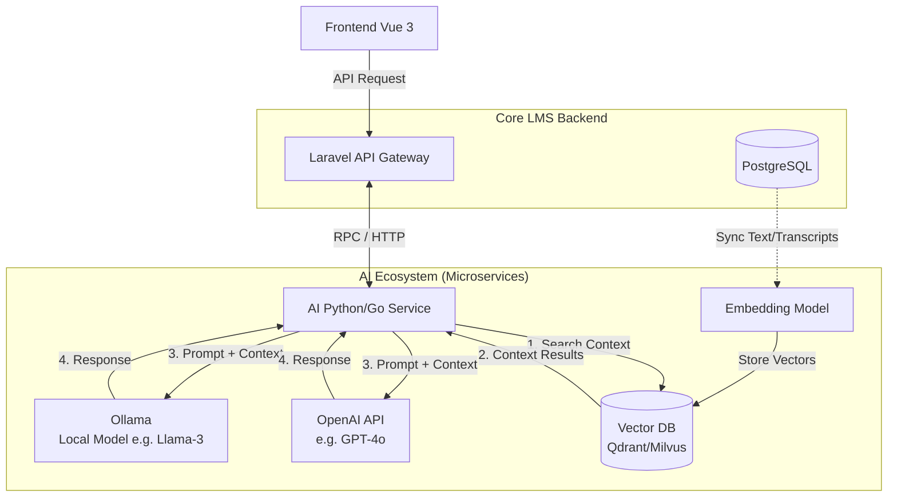

# Tahap 10: AI Ecosystem Integration (Architecture)

Untuk meningkatkan efisiensi dan personalisasi pembelajaran, platform Enterprise LMS ini diintegrasikan dengan kapabilitas *Artificial Intelligence* (AI). Arsitektur dirancang secara *hybrid*: menggunakan API publik (OpenAI Compatible) untuk tugas generatif ringan, dan AI lokal (Ollama) dengan RAG (*Retrieval-Augmented Generation*) untuk keamanan data serta konteks materi spesifik.

---

## 1. High-Level AI Architecture

Arsitektur AI akan berdiri sebagai *Microservice* tersendiri (**AI Service Engine**) yang berkomunikasi secara asinkron (via NATS) maupun sinkron (via REST API) dengan layanan utama Laravel.

---

## 2. Rincian Fitur AI & Alur Kerjanya

### A. AI Tutor (RAG Based)
**Fungsi:** Asisten virtual (Chatbot) yang membantu siswa saat kebingungan dalam memahami suatu modul kursus. Chatbot ini harus memberikan jawaban berdasarkan *materi kursus yang sedang ditonton*, bukan sekadar pengetahuan internet umum.
**Teknologi:** RAG + Vector Database + Ollama (Privacy-first).
**Alur (Data Flow):**
1. Saat instruktur mengunggah teks materi atau transkrip video, **Embedding Model** mengubah teks menjadi angka vektor dan menyimpannya di **Vector DB**.
2. Siswa bertanya di *Lesson Page*: *"Apa itu Composition API?"*.
3. Sistem mencari bagian transkrip yang paling relevan (Vector Search).
4. Potongan transkrip tersebut digabung dengan pertanyaan siswa lalu dikirim ke **Ollama** (*"Berdasarkan teks berikut, jawab pertanyaan siswa..."*).

### B. AI Quiz, Exam, & Assignment Generator
**Fungsi:** Membantu instruktur membuat evaluasi hanya dengan menekan satu tombol ("Generate Quiz from this Lesson").
**Teknologi:** OpenAI Compatible API (Karena butuh penalaran tingkat tinggi dan format output JSON yang ketat).
**Alur:**
1. Instruktur meminta kuis untuk suatu modul.
2. AI Service mengambil teks materi dari *PostgreSQL*.
3. Sistem mengirimkan *prompt* ke LLM Cloud dengan *System Message*: *"Bertindaklah sebagai pembuat soal ujian tingkat lanjut. Buat 10 soal pilihan ganda berdasarkan teks ini. Kembalikan HANYA dalam format JSON..."*.
4. Respons LLM diurai (parsed), divalidasi keamanannya, lalu disimpan ke tabel `quizzes`.

### C. AI Learning Path
**Fungsi:** Menghasilkan kurikulum dinamis bagi siswa berdasarkan minat dan tingkat keterampilan saat ini.
**Teknologi:** LLM (Ollama/OpenAI).
**Alur:**
1. Saat registrasi (atau survei), siswa menginput: *"Saya ingin menjadi Frontend Engineer tapi saya hanya mengerti HTML/CSS"*.
2. AI menganalisis katalog kursus yang tersedia.
3. AI memberikan peta jalan (*Learning Path*):
   - Bulan 1: Kursus Dasar JavaScript.
   - Bulan 2: Kursus Vue 3 Dasar.
   - Bulan 3: Proyek Portofolio.

### D. AI Recommendation System
**Fungsi:** Merekomendasikan kursus yang mirip dengan kursus yang pernah dibeli atau dilihat.
**Teknologi:** Vector Database + Embedding Model (Tanpa LLM Generatif).
**Alur:**
1. Judul, deskripsi, dan *tag* semua kursus diubah menjadi Vektor.
2. Jika pengguna membeli "Kursus Vue 3", sistem melakukan kueri "Vector Similarity Search" (misal: *Cosine Similarity*) ke Vector DB.
3. Hasil (Top 5 kursus paling mirip seperti "Nuxt 3" atau "State Management Pinia") dikirim kembali ke *Frontend*. Jauh lebih pintar dari sekadar pencarian *Keyword*.

### E. AI Analytics Insight
**Fungsi:** Menarik kesimpulan teks (summary) bagi *Super Admin* dan *Instructor* agar tidak perlu menganalisis chart rumit secara manual.
**Teknologi:** ClickHouse (Data source) + LLM Cloud (OpenAI).
**Alur:**
1. *Cron Job* harian mengambil angka mentah agregat dari ClickHouse (misal: Pendaftaran -20%, Penyelesaian Kursus A +5%).
2. Angka tersebut dikirimkan ke LLM.
3. LLM menyusun laporan naratif: *"Tren pendapatan Anda minggu ini menurun karena kurangnya pendaftaran di kursus X. Kami menyarankan memberikan diskon pada kursus tersebut karena persentase penyelesaiannya sangat tinggi (siswa menyukainya)."*
4. Narasi ditampilkan di **Dashboard**.

---

## 3. Komponen Teknologi Utama

1. **Vector Database (Qdrant / Milvus):** Digunakan khusus untuk RAG dan Sistem Rekomendasi karena sangat efisien menghitung kemiripan jutaan dokumen teks dalam sepersekian detik.
2. **Ollama:** Menjalankan model *Open-Source* seperti Llama-3 atau Mistral di server internal (*on-premise*). Sangat penting untuk **AI Tutor** guna menghemat biaya API bulanan (karena siswa bisa bertanya tanpa batas) dan menjaga kerahasiaan materi kursus premium.
3. **OpenAI Compatible API:** Bisa merujuk ke layanan seperti OpenAI (GPT-4o), Anthropic, atau vLLM. Digunakan untuk tugas rumit seperti pembuatan kuis (Generator) karena model ini sangat patuh pada instruksi *formatting JSON*.
4. **NATS Message Broker:** Jika proses *generate Exam* (Ujian) memakan waktu 10-30 detik dari LLM, NATS menangani pekerjaan tersebut di latar belakang secara asinkron agar *request HTTP* tidak *timeout*. Setelah selesai, *WebSocket* akan memberi tahu klien (Vue 3).