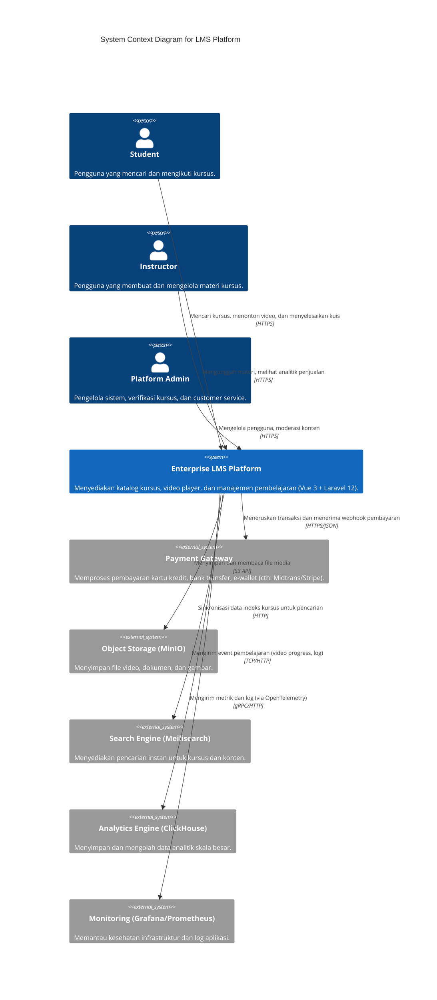
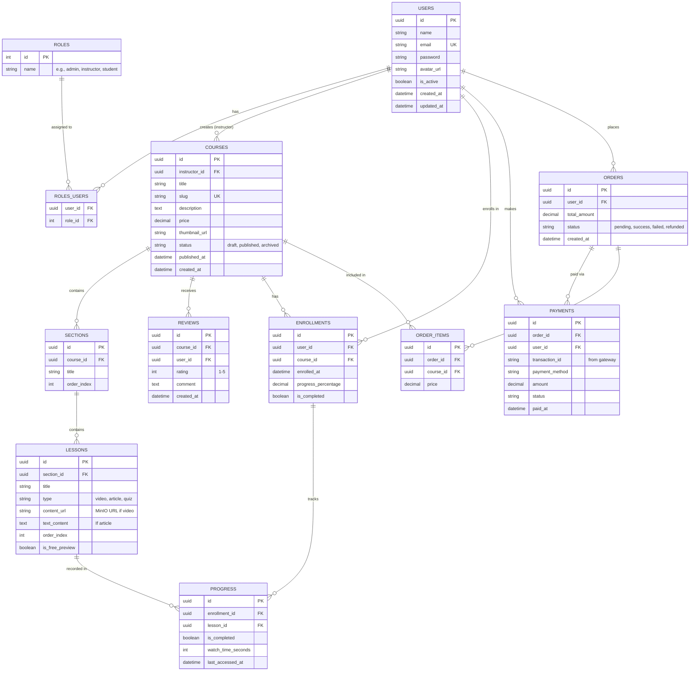

# Tahap 2: Architecture & System Design

LMS Platform (Enterprise Grade)

## 1. Arsitektur Sistem (Clean Architecture & Domain-Driven Design)

Platform ini mengadopsi prinsip **Clean Architecture** yang diintegrasikan dengan **Domain-Driven Design (DDD)**. Karena kita menggunakan Laravel (yang berbasis MVC), kita akan mengadaptasinya menjadi struktur *Modular Monolith*. Hal ini memastikan sistem mudah dipelihara, *scalable*, dan batas-batas domain (Bounded Contexts) tetap terjaga.

### Bounded Contexts Utama:
1.  **Identity & Access (IAM):** Autentikasi, manajemen pengguna (User, Role, Permission).
2.  **Catalog (Course Management):** Manajemen kategori, kursus, modul, silabus, dan review.
3.  **Enrollment & Learning:** Manajemen kepesertaan siswa, pelacakan progres (video/kuis), sertifikasi.
4.  **Billing & Payment:** Manajemen keranjang (cart), order, integrasi payment gateway, invoice.

### Struktur Layer per Domain (Clean Architecture):
-   **Domain Layer:** Entitas bisnis murni, Value Objects, Domain Events. *Tidak bergantung pada framework.*
-   **Application Layer:** Use Cases (Service classes), DTOs, dan CQS/CQRS (Command/Query Handlers). Mengkoordinasikan Domain layer.
-   **Infrastructure Layer:** Implementasi konkret dari interface (Repository pattern untuk Eloquent), interaksi dengan cache (Redis), storage (MinIO), search (Meilisearch), NATS, dan API pihak ketiga.
-   **Presentation/UI Layer:** API Controllers (Laravel), Middleware, Form Requests. Mengolah HTTP request dan mengembalikan JSON response ke Frontend (Vue 3).

---

## 2. C4 Model (Context Diagram)

Diagram berikut menggunakan standar C4 Model level 1 (System Context) untuk menggambarkan bagaimana aktor dan sistem eksternal berinteraksi dengan LMS Platform.



---

## 3. Database Entity Relationship Diagram (ERD)

ERD di bawah ini merepresentasikan struktur data MVP dari LMS Platform yang akan diimplementasikan pada PostgreSQL.



---

## 4. API Contracts & Batasan Modul

Untuk menjaga agar aplikasi dapat di-*maintain* dengan baik, setiap modul hanya boleh berkomunikasi dengan modul lain melalui antarmuka yang didefinisikan (Interface/API) atau menggunakan Event-Driven architecture (menggunakan Laravel Events atau NATS).

**Contoh Event-Driven Flow (Asynchronous):**
1. Saat pesanan dibayar secara sukses (`OrderPaidEvent` dipicu).
2. Domain *Enrollment* mendengarkan event tersebut dan secara otomatis membuat rekam jejak `ENROLLMENT` untuk user tersebut.
3. Domain *Notification* mendengarkan event tersebut dan mengirimkan email selamat datang ke siswa.
4. Data analitik (pembelian) dikirimkan secara asinkron ke *ClickHouse*.

**Komunikasi Frontend & Backend:**
- **Protokol:** RESTful JSON API (dan kemungkinan GraphQL ke depannya untuk query kompleks).
- **Autentikasi API:** Menggunakan Laravel Sanctum (Stateful cookie untuk web app, Token untuk mobile app di masa depan).
- **Format Response Standar:**
  ```json
  {
      "success": true,
      "message": "Data retrieved successfully",
      "data": { ... },
      "meta": { ... } // Untuk pagination dll.
  }
  ```

---

### Penjelasan Teknis Tambahan:
- **Modularitas di Laravel:** Kita akan memisahkan domain menjadi folder seperti `app/Domain/Course`, `app/Domain/User`, dll., bukan menggunakan struktur MVC standar (`app/Models`, `app/Controllers` tercampur semua domain). Ini memastikan *Clean Architecture*.
- **PostgreSQL UUID:** Kita menggunakan tipe UUID untuk *Primary Key* guna keamanan ID yang tidak tertebak, terutama pada entitas utama seperti User, Course, Order, dll.
