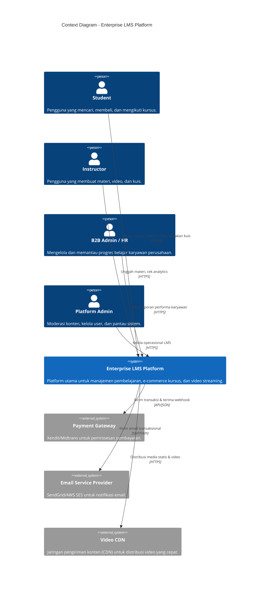
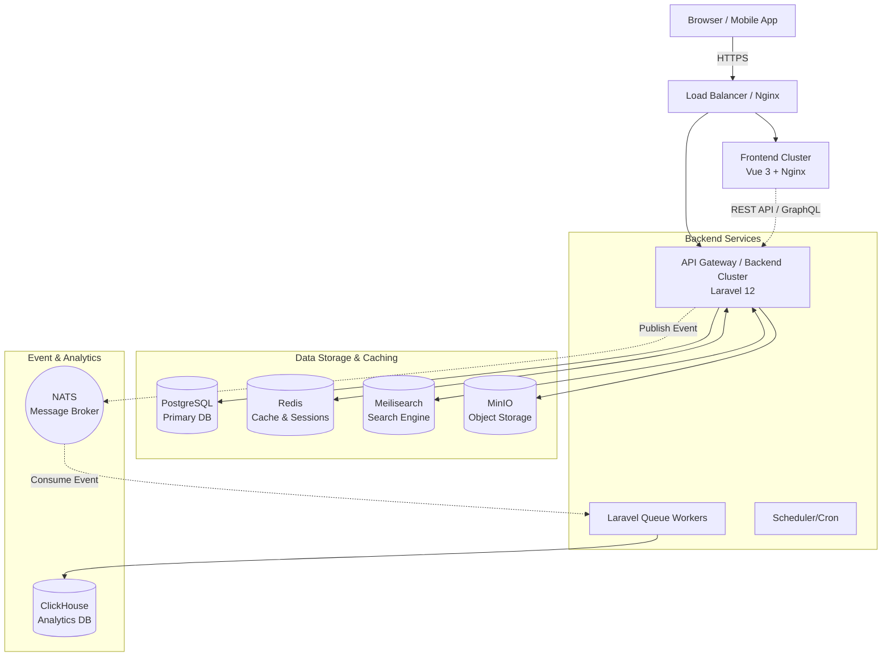
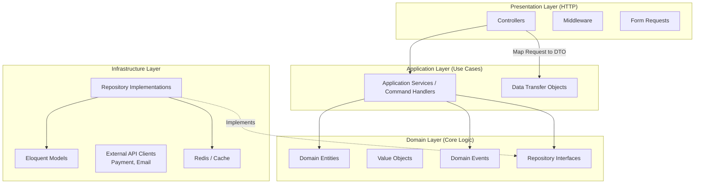
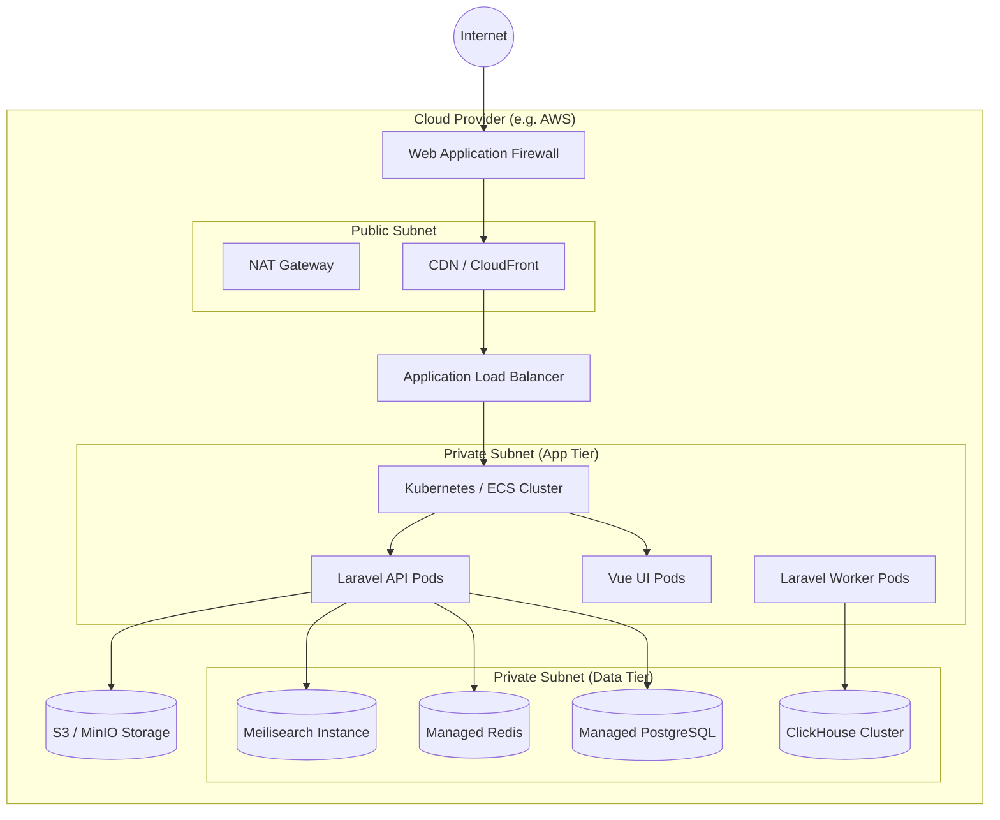
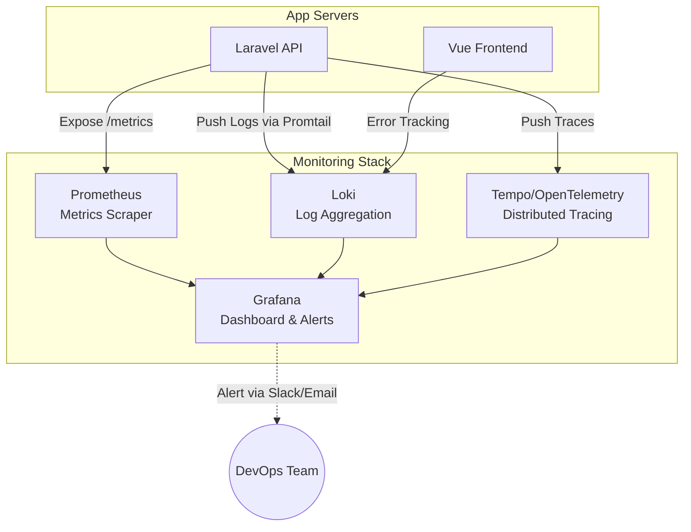
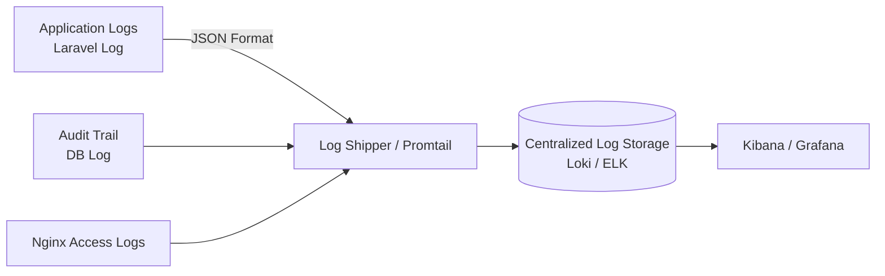
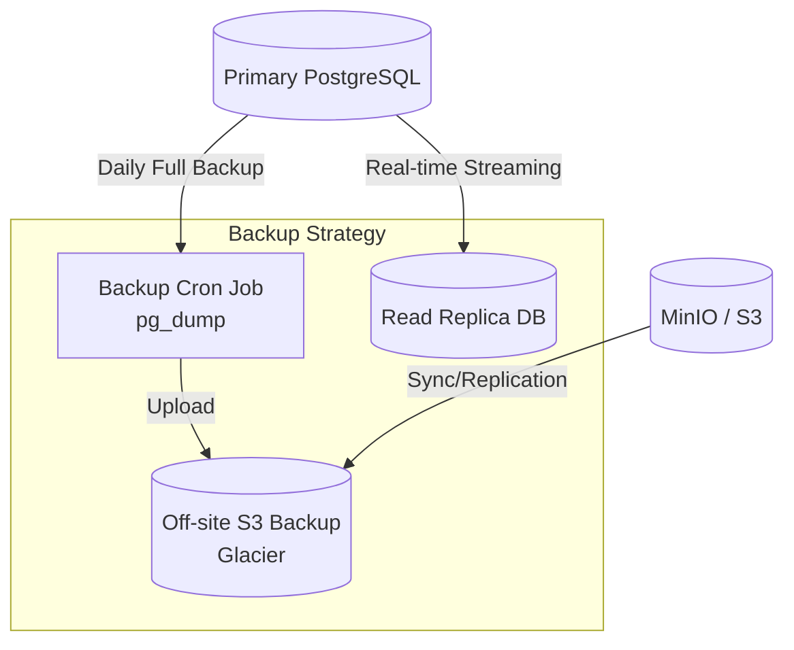

# Tahap 2: Detailed Architecture & System Design

LMS Platform (Enterprise Grade)

## 1. Context Diagram

Diagram ini menunjukkan gambaran sistem dalam ekosistem bisnis secara keseluruhan, aktor yang terlibat, dan interaksinya dengan sistem eksternal.



**Penjelasan Komponen:**
- **Sistem Inti:** Berperan sebagai jembatan antara instruktur (kreator) dan siswa (konsumen).
- **Sistem Eksternal:** Layanan pihak ketiga yang tidak dikembangkan dari awal karena sudah ada solusi enterprise yang tangguh (Pembayaran, Email, dan CDN).

---

## 2. High Level Architecture

Menjelaskan bagaimana infrastruktur fisik/logis disusun di level makro.



**Penjelasan Komponen:**
- **Load Balancer:** Menangani *traffic routing* dan SSL Termination.
- **Frontend Cluster:** Menyajikan file statis SPA Vue 3.
- **Backend Cluster:** Berisi instans API Laravel. Dapat di-scale secara horizontal.
- **Queue Workers:** Memproses tugas berat secara *asynchronous* (misal: kirim email, render sertifikat).
- **NATS & ClickHouse:** NATS menangani aliran pesan (event) dalam volume tinggi, yang kemudian diserap oleh ClickHouse untuk kebutuhan analitik tanpa membebani PostgreSQL.

---

## 3. Low Level Architecture (Backend Clean Architecture)

Menggambarkan bagaimana kode di dalam aplikasi Laravel (Modular Monolith) disusun.



**Penjelasan Komponen:**
- **Presentation:** Menerima *request* dari luar dan mengembalikan JSON.
- **Application:** Orkestrasi logika. Tidak memiliki aturan bisnis murni, hanya mengatur aliran (misal: "ambil data dari repo, panggil entitas, simpan ke repo").
- **Domain:** Inti sistem. Tidak tahu-menahu soal Laravel/Database. Berisi logika murni seperti *EnrollmentRules*, *CoursePricing*.
- **Infrastructure:** Kode yang berinteraksi langsung dengan database (Eloquent) atau sistem eksternal.

---

## 4. Component Diagram

Diagram komponen untuk satu domain spesifik, misalnya **Course Catalog Domain**.

```mermaid
componentDiagram
    package "Course Catalog Domain" {
        [CourseController]
        [CourseService]
        [CourseRepository]
        [MeilisearchSyncListener]
    }

    database "PostgreSQL" {
        [courses_table]
    }

    database "Meilisearch" {
        [course_index]
    }

    [Vue Frontend] --> [CourseController] : GET /api/courses
    [CourseController] --> [CourseService] : getCourses(filters)
    [CourseService] --> [CourseRepository] : findActiveCourses()
    [CourseRepository] --> [courses_table] : SQL Query

    [CourseService] ..> [MeilisearchSyncListener] : triggers Event
    [MeilisearchSyncListener] --> [course_index] : Sync Data
```

**Penjelasan Komponen:**
Menunjukkan isolasi domain. Jika data kursus berubah, event akan dipicu untuk memastikan *Search Engine* (Meilisearch) selalu mutakhir tanpa harus membebani *flow* utama.

---

## 5. Deployment Diagram

Menjelaskan bagaimana infrastruktur didistribusikan di lingkungan *Cloud* (misal: AWS/GCP).



**Penjelasan Komponen:**
Pemisahan zona jaringan. Database dan *App Server* berada di *Private Subnet* sehingga tidak bisa diakses langsung dari internet, hanya bisa melalui *Load Balancer* di *Public Subnet*.

---

## 6. Security Architecture

Fokus pada pengamanan data dan akses.

```mermaid
flowchart LR
    User((User)) -->|1. Request with JWT/Sanctum Cookie| WAF[WAF / Rate Limiter]
    WAF -->|2. Passed| API[API Gateway]

    subgraph "Security Controls"
        AuthMiddleware[Authentication Middleware]
        Policy[Authorization Policies / RBAC]
        Sanitizer[Input Sanitizer / Form Request]
    end

    API --> AuthMiddleware
    AuthMiddleware -->|3. Valid Token| Policy
    Policy -->|4. Has Permission| Sanitizer
    Sanitizer -->|5. Clean Data| Controller[Business Logic]

    Controller --> DB[(Database)]

    style AuthMiddleware fill:#f9f,stroke:#333,stroke-width:2px
    style Policy fill:#f9f,stroke:#333,stroke-width:2px
```



**Penjelasan Komponen:**
- **WAF & Rate Limiter:** Melindungi dari serangan DDoS dan Brute Force.
- **Auth & Policy:** Autentikasi memastikan *siapa* penggunanya, sedangkan Policy (RBAC) memastikan apakah ia punya *hak* untuk melakukan tindakan tersebut (misal: hanya instruktur pemilik kursus yang bisa mengubah harga).
- **Data Encryption:** Password di-hash menggunakan Argon2/Bcrypt, transaksi TLS/HTTPS wajib.

---

## 7. Monitoring Architecture

Memastikan sistem bisa diobservasi (*Observability*) oleh tim DevOps.



**Penjelasan Komponen:**
- **Prometheus:** Mengumpulkan metrik (CPU, Memory, Request Rate).
- **Loki:** Mengumpulkan log aplikasi (error logs).
- **Tempo:** Melacak satu *request* dari ujung ke ujung untuk menganalisis *bottleneck* performa.
- **Grafana:** Visualisasi seluruh data dan mengirimkan alarm jika ada anomali.

---

## 8. Logging Architecture

Standarisasi pencatatan aktivitas.



**Penjelasan Komponen:**
- Aplikasi harus membuang log dalam format **JSON** agar mudah diurai (parsed).
- **Audit Trail:** Mencatat *siapa melakukan apa dan kapan* (misal: "Admin A mengubah harga Kursus B dari 100k ke 50k pada jam 10:00").

---

## 9. Backup Architecture

Strategi untuk *Disaster Recovery*.



**Penjelasan Komponen:**
- **High Availability:** Menggunakan *Read Replica* secara real-time. Jika Primary mati, Replica akan naik menjadi Primary (Auto Failover).
- **Disaster Recovery:** *Daily Full Backup* disimpan di *cold storage* yang berbeda region/provider (misal AWS S3 Glacier) untuk mencegah kehilangan data akibat bencana fisik atau peretasan.