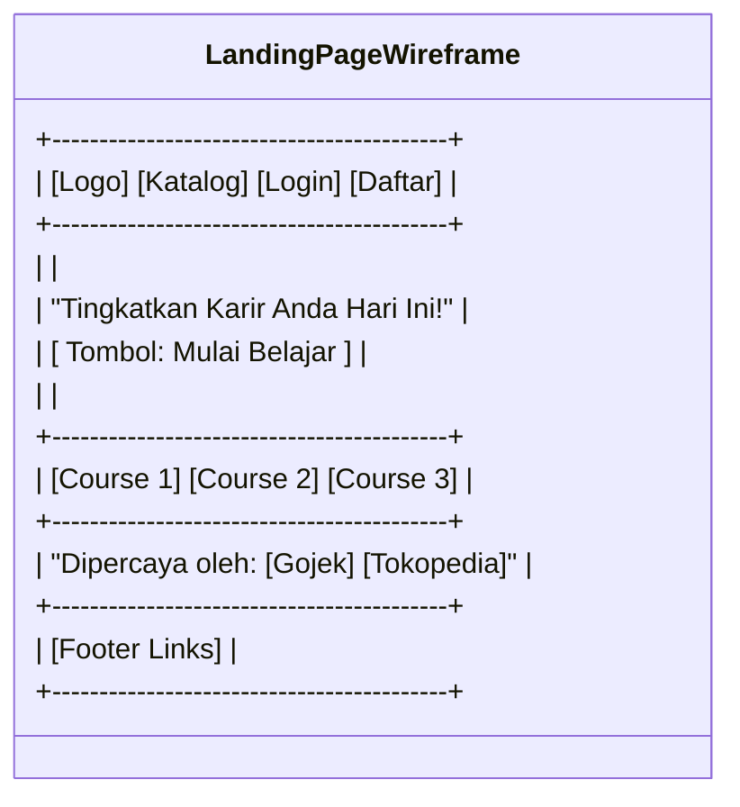
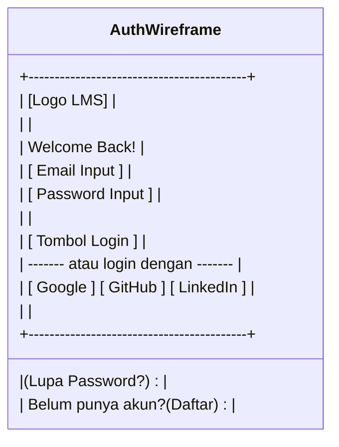
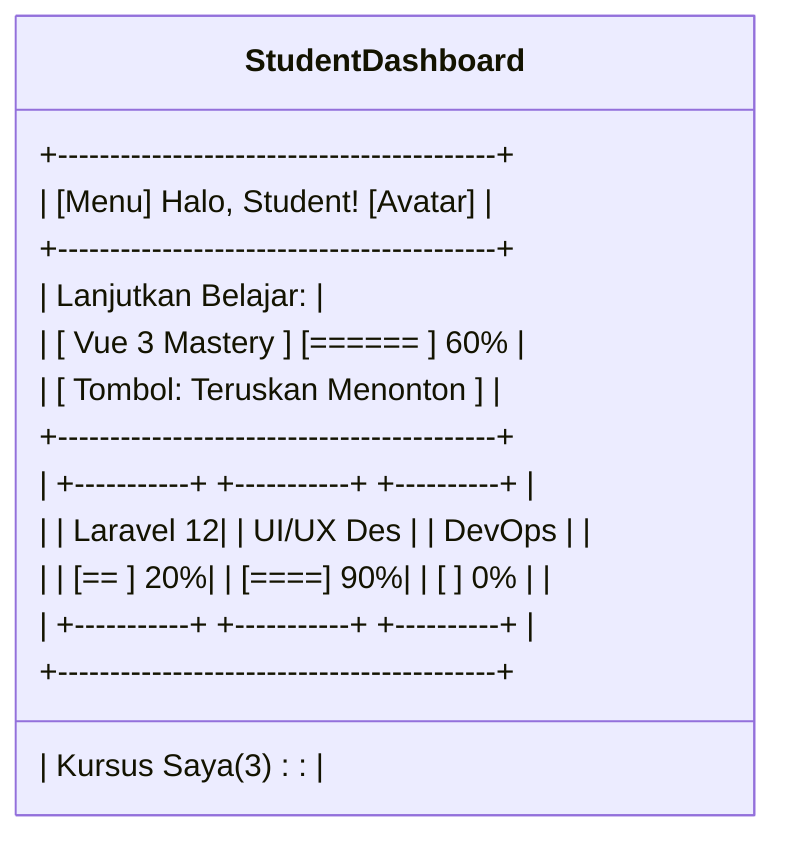
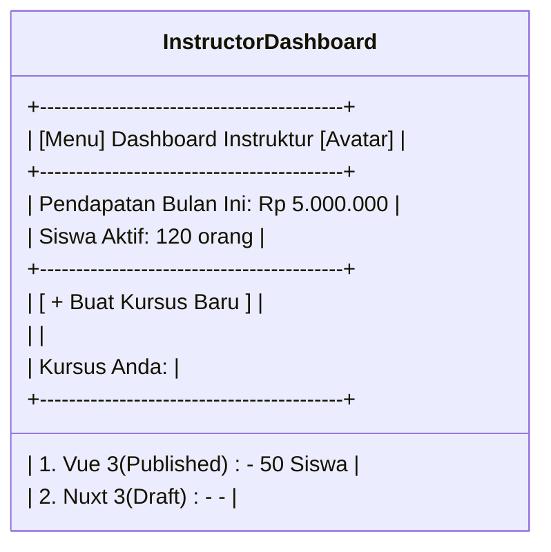
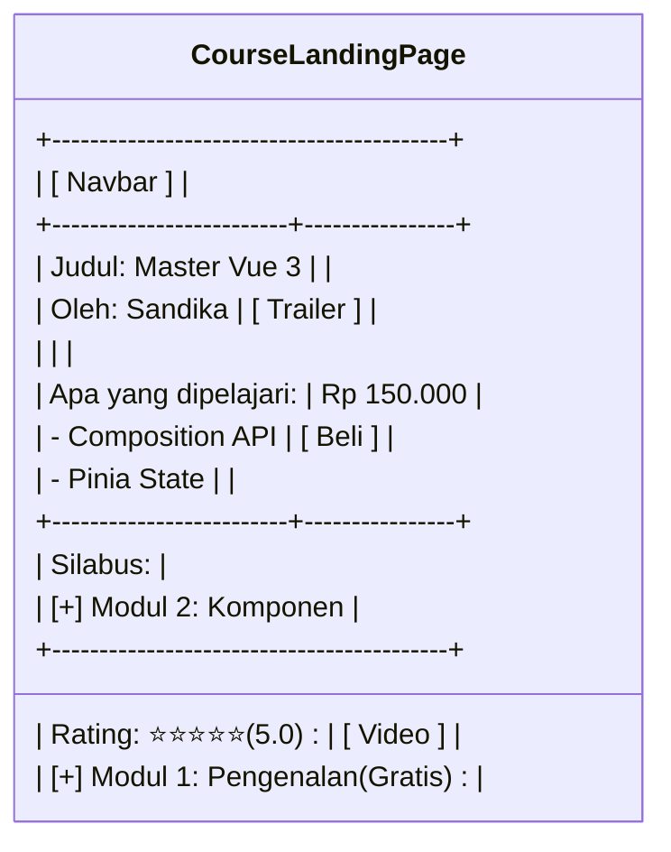
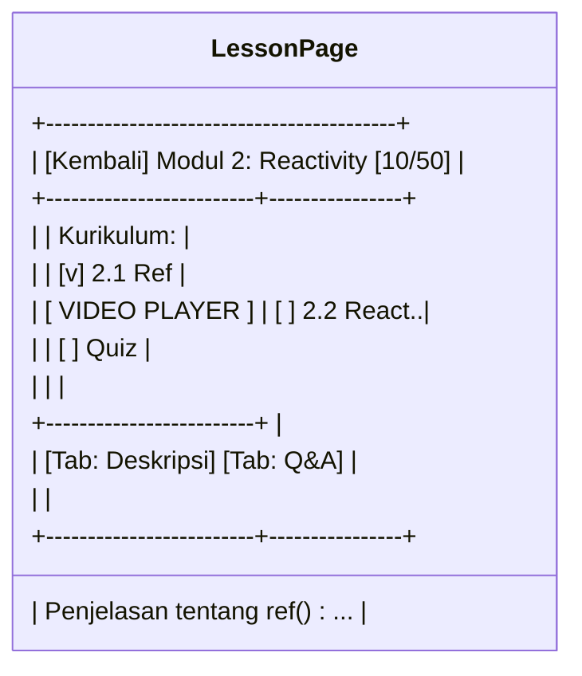

# Tahap 5: UI/UX Design & Wireframing

Sistem Enterprise LMS dirancang untuk menyajikan *user experience* (UX) yang mulus dengan *interface* yang bersih (*clean UI*). Desain dibuat dengan pendekatan *Mobile-First* menggunakan **Tailwind CSS** dan **Shadcn Vue**.

Berikut adalah rancangan UI/UX untuk halaman-halaman utama.

---

## 1. Landing Page

**Tujuan:** Menarik pengunjung, menjelaskan *value proposition* (keunggulan), dan menampilkan katalog kursus unggulan untuk mendorong registrasi.

**Komponen:**
- Hero Section (Headline, Sub-headline, Call-to-Action "Mulai Belajar").
- Featured Courses (Grid Card kursus populer).
- Social Proof (Testimoni, Logo Perusahaan Klien).
- Footer (Link navigasi, Syarat & Ketentuan).

**UX Flow:** Pengunjung mendarat -> Scroll lihat fitur -> Klik "Lihat Katalog" atau "Daftar Gratis" -> Diarahkan ke halaman terkait.

**Mobile Responsive:** Hero section menjadi *stack* vertikal. Grid kursus berubah dari 4 kolom menjadi 1 kolom yang dapat di-*swipe* horisontal (carousel).

---

## 2. Login & Register

**Tujuan:** Autentikasi pengguna secara aman dan meminimalkan gesekan (friction) pendaftaran.

**Komponen:**
- Form Input (Email, Password, Name).
- Opsi *Social Login* (Google, GitHub, LinkedIn).
- Link "Lupa Password".

**UX Flow:** Masukkan kredensial -> Validasi *client-side* (Zod/VeeValidate) -> Loading state di tombol -> Redirect ke Dashboard sesuai *Role*.

**Mobile Responsive:** Form memenuhi layar, tombol aksi lebih besar (min 44px *touch target*).

---

## 3. Student Dashboard

**Tujuan:** Menampilkan *progress* belajar siswa agar mereka termotivasi melanjutkan kelas.

**Komponen:**
- Sidebar Navigasi.
- "Lanjutkan Belajar" (Resume Course terakhir).
- My Courses (Grid kursus yang dibeli beserta % progress bar).
- Sertifikat Saya.

**UX Flow:** Login -> Masuk Dashboard -> Klik "Lanjutkan" pada kursus terakhir -> Langsung masuk ke Lesson Page.

**Mobile Responsive:** Sidebar menjadi *Hamburger Menu* di navbar bawah (Bottom Tab Nav).

---

## 4. Instructor Dashboard

**Tujuan:** Pusat manajemen konten bagi pembuat kursus, fokus pada kreasi dan analitik.

**Komponen:**
- Ringkasan Pendapatan & Siswa Aktif.
- Tombol CTA "Buat Kursus Baru".
- Daftar Kursus (Draft, Pending, Published).
- Notifikasi Q&A siswa.

**UX Flow:** Lihat statistik -> Cek ada Q&A belum dibalas -> Buat materi kursus baru -> Draft disimpan otomatis.

**Mobile Responsive:** Tabel daftar kursus berubah menjadi *Card Layout* vertikal.

---

## 5. Admin Dashboard

**Tujuan:** Kontrol utama sistem (Moderasi, User, Finansial).

**Komponen:**
- Sidebar Komprehensif (Users, Courses, Financial, Settings).
- Moderation Queue (Kursus yang menunggu di-*approve*).
- System Health (Uptime, Error rate).

**UX Flow:** Cek Moderation Queue -> Review video instruktur -> Klik "Approve" atau "Reject" dengan alasan.

**Mobile Responsive:** Hanya responsif minimal, diasumsikan admin membuka ini di Desktop/Tablet.

---

## 6. Course Landing Page

**Tujuan:** Halaman penjualan (sales page) sebuah kursus spesifik sebelum dibeli.

**Komponen:**
- Video Trailer.
- Harga & Tombol "Beli Sekarang" / "Enroll".
- Silabus (Daftar materi yang bisa di-expand).
- Profil Instruktur & Review/Rating.

**UX Flow:** Baca deskripsi -> Lihat kurikulum -> Klik Beli -> Masuk ke proses Checkout.

---

## 7. Lesson Page (Learning Area)

**Tujuan:** Pengalaman belajar tanpa gangguan (*distraction-free learning*).

**Komponen:**
- Video Player Besar di tengah.
- Sidebar Kurikulum (untuk melompat antar materi).
- Tab Content: Deskripsi, Q&A (Forum), Resource (Download file).

**UX Flow:** Menonton video -> Video selesai -> *Auto-play* ke materi selanjutnya -> Centang hijau muncul di sidebar.

**Mobile Responsive:** Sidebar kurikulum disembunyikan dalam *Drawer* / tombol "Daftar Materi". Video melekat di atas.

---

## 8. Quiz & Assignment Page

**Tujuan:** Evaluasi pemahaman siswa secara interaktif.

**Komponen:**
- Timer hitung mundur (Jika diset).
- Pertanyaan Pilihan Ganda (Radio buttons).
- Form Upload (Untuk Assignment/Tugas akhir).
- Tombol Submit & Hasil (Skor langsung keluar jika pilihan ganda).

**UX Flow:** Baca instruksi -> Kerjakan -> Submit -> Dapat *Feedback* (Lulus/Gagal).

---

## 9. Certificate Page

**Tujuan:** Halaman apresiasi dan bukti kelulusan yang bisa dibagikan (verifiable).

**Komponen:**
- Gambar Sertifikat (Bisa diunduh PDF/JPG).
- Nomor Verifikasi Unik.
- Tombol "Share ke LinkedIn / Twitter".

**UX Flow:** Kursus 100% selesai -> Klik "Klaim Sertifikat" -> Sistem meng-*generate* PDF -> Siswa membagikan ke sosial media.

---

## 10. Analytics Page (B2B / Instructor)

**Tujuan:** Memvisualisasikan data rumit menjadi wawasan yang mudah dipahami (mengambil data dari ClickHouse).

**Komponen:**
- Chart Bar / Line (Pendapatan per hari, Tren Pendaftaran).
- Tabel Top Performing Courses.
- Filter (Berdasarkan tanggal, bulan, tahun).

**UX Flow:** Pilih rentang waktu (Date picker) -> Chart ter-*update* (AJAX) -> Export CSV jika diperlukan.

**Mobile Responsive:** Chart bisa di-*scroll* horisontal untuk mencegah *layout break*.